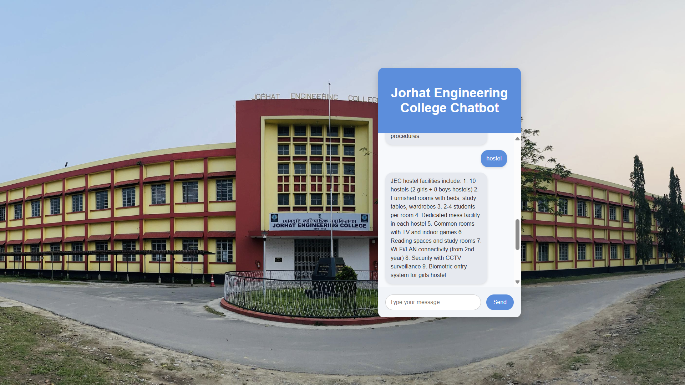

# Chatbot for JEC Assam

This is a chatbot project designed to provide automated responses to queries related to JEC Assam. The chatbot uses machine learning, natural language processing (NLP), and web technologies to classify user inputs and deliver accurate responses.

---

## **Features**
- Handles frequently asked questions about JEC Assam, such as admissions, departments, and contact information.
- Interactive user interface with real-time responses.
- Trained using a neural network model for intent classification.
- Fully integrated with the Django web framework for robust backend support.

---

## **Technologies Used**

### **Backend**
- Python
- Django
- TensorFlow/Keras (for training the neural network model)

### **Frontend**
- HTML
- CSS
- JavaScript (with AJAX for real-time interaction)

### **Libraries and Tools**
- NLTK (Natural Language Toolkit) for text preprocessing
- JSON for intent storage
- SQLite for database management (Django default)

---

## **How It Works**

### **1. Data Preprocessing**
- Tokenization: User queries are broken into words.
- Lemmatization: Words are reduced to their base forms for uniformity.
- Data is converted into a bag-of-words format and intents are one-hot encoded for training.

### **2. Model Development**
- A sequential neural network is built using TensorFlow/Keras.
- The model consists of:
  - Input Layer: Accepts bag-of-words vectors.
  - Hidden Layers: Use ReLU activation to learn patterns.
  - Output Layer: Uses softmax activation to classify intents.
- Dropout layers prevent overfitting, ensuring the model performs well on unseen data.
- The model is trained over multiple epochs using the SGD optimizer to minimize error.

### **3. Integration**
- The trained model is integrated with a Django-based backend.
- User inputs are processed by the backend, classified by the model, and appropriate responses are returned.
- AJAX is used for real-time communication between the frontend and backend.

---

## **Installation**

### **Clone the Repository**
```bash
https://github.com/ruhul-bot/chatbot-jec.git
```

### **Set Up the Environment**
1. Create a virtual environment:
   ```bash
   python -m venv env
   ```
2. Activate the virtual environment:
   - On Windows:
     ```bash
     .\env\Scripts\activate
     ```
   - On macOS/Linux:
     ```bash
     source env/bin/activate
     ```
3. Install dependencies:
   ```bash
   pip install -r requirements.txt
   ```

### **Set Up Django**
1. Make migrations:
   ```bash
   python manage.py makemigrations
   python manage.py migrate
   ```
2. Create a superuser:
   ```bash
   python manage.py createsuperuser
   ```

### **Run the Server**
```bash
python manage.py runserver
```

### **Access the Application**
Open your browser and navigate to:
```
http://127.0.0.1:8000
```

---

## **Project Structure**
```
chatbot-project/
|-- chat_app/
|   |-- migrations/
|   |-- static/         # CSS, JS, and images
|   |-- templates/      # HTML templates
|   |-- __init__.py
|   |-- admin.py
|   |-- apps.py
|   |-- models.py
|   |-- urls.py
|   |-- views.py
|
|-- chatbot/
|   |-- __init__.py
|   |-- settings.py      # Django settings
|   |-- urls.py          # Project URL routing
|   |-- wsgi.py
|
|-- intents.json         # Training data
|-- chatbot_model.h5     # Trained model
|-- words.pkl            # Vocabulary
|-- classes.pkl          # Intent classes
|-- db.sqlite3           # Database
|-- manage.py            # Django management script
|-- requirements.txt     # Dependencies
```

### Chatbot UI
Below is a screenshot of the chatbot interface:



---

## **Contributors**
- [Bhaskar Jyoti Kaushik](https://github.com/bhaskarjyotikaushik)
- [Ruhul Amin Sikdar](https://github.com/ruhul-bot)

---

## **License**
This project is licensed under the MIT License. See `LICENSE` for more details.
